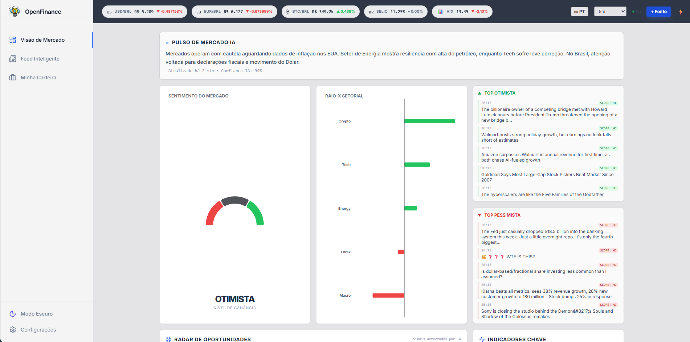
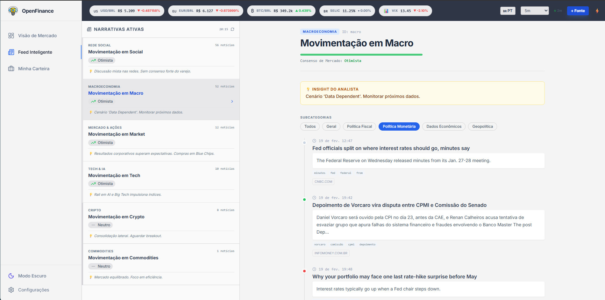
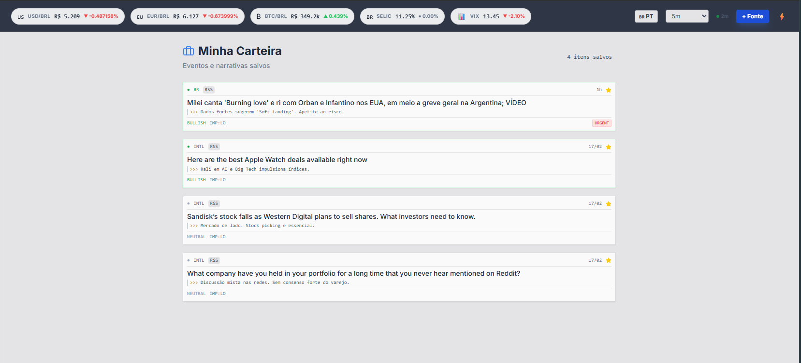

# OpenFinance Intel 🌍⚡

**Terminal de Inteligência de Investimentos** — IA, NLP e Análise de Sentimento para transformar o caos do mercado em **Sinais Acionáveis**.

O OpenFinance Intel monitora o ecossistema financeiro global em tempo real, coletando notícias, feeds de redes sociais e dados macroeconômicos. Usando **NLP** e **Análise de Sentimento**, classifica cada evento como Bullish, Bearish ou Neutral e os organiza em 6 setores de investimento.

---

## 🚀 Funcionalidades Visuais

### 1. Market Overview (Visão Geral)

O painel de controle do investidor. Aqui você tem o pulso do mercado em uma única tela.

- **🧠 Bento Grid**: Layout moderno e responsivo.
- **📊 Fear & Greed Index**: Medidor de sentimento em tempo real (0-100).
- **🎯 Radar de Oportunidades**: Identifica anomalias e tendências de alta convicção.
- **⚡ Ticker**: Cotações de USD, EUR e BTC ao vivo.



---

### 2. Intelligence Feed (Feed de Inteligência)

Onde a notícia vira dado. O feed processa milhares de manchetes e entrega apenas o que importa.

- **🤖 Análise de IA**: Cada notícia recebe uma tag de sentimento (Bullish/Bearish) e um **Insight Acionável**.
- **🏷️ Filtros Macro**: Subcategorias granulares (Política Monetária, Geopolítica, Fiscal, Dados Econômicos).
- **📱 Social Sentiment**: Monitoramento de Reddit (WSB, Investing) e Twitter para captar o "humor da multidão".



---

### 3. Watchlist (Carteira de Monitoramento)

Nunca perca uma narrativa. Salve eventos e acompanhe o desdobramento da história.

- **⭐ Favoritos**: Clique na estrela em qualquer evento para salvar.
- **💾 Persistência**: Seus dados ficam salvos no navegador (Local Storage).
- **📉 Gestão de Risco**: Monitore ameaças potenciais de perto.



---

### 4. Configurações & Personalização

O terminal é seu. Ajuste para o seu fluxo de trabalho.

- **🎨 Temas**: Dark Mode (padrão) e Light Mode.
- **🌎 Idioma**: Tradução instantânea PT-BR / EN-US.
- **⏱️ Auto-Refresh**: Configure intervalos de 1 a 20 minutos para atualizações automáticas.


---

## 🏗️ Arquitetura Técnica

Todo o sistema roda em **Docker**, orquestrado via Docker Compose.

```mermaid
graph TD
    User[Usuário] -->|HTTP:80| Nginx[Dashboard (Nginx + React)]
    Nginx -->|/api| API[API Gateway (FastAPI)]

    API -->|Task| Redis[Redis Queue]
    Redis --> Collector[Collector Service]
    Redis --> Analysis[Analysis Service (NLP)]
    Redis --> Notifier[Notifier Service]

    Collector -->|Raw Data| Mongo[(MongoDB)]
    Analysis -->|Enriched Data| Mongo
    API -->|Query| Mongo
```

| Serviço       | Tecnologia              | Responsabilidade                               |
| ------------- | ----------------------- | ---------------------------------------------- |
| **Collector** | Python                  | Scraping RSS/Atom/Reddit, deduplicação via MD5 |
| **Analysis**  | Python, spaCy, TextBlob | NLP, Sentimento, Classificação Setorial        |
| **API**       | Python, FastAPI         | Interface REST, Scheduler, Gestão de Fontes    |
| **Dashboard** | React 18, Vite, Nginx   | UI SPA, Nginx Reverse Proxy (Porta 80)         |
| **Dados**     | MongoDB, Redis          | Persistência (NoSQL) e Mensageria (Pub/Sub)    |

---

## ⚡ Início Rápido

### Pré-requisitos

- Docker & Docker Compose

### Como Rodar

```bash
# 1. Clone o repositório
git clone https://github.com/Haell39/OpenFinance_Intel.git

# 2. Suba o ambiente (Build automático)
docker compose up --build
```

Acesse: **http://localhost** (porta 80)

> O sistema leva ~2 min para iniciar a coleta e preencher o banco de dados na primeira vez.

---

## 🚀 Deploy em Produção

Consulte o guia oficial **[doc/DEPLOY.md](doc/DEPLOY.md)** para instruções passo-a-passo:

- **VPS (Oracle Cloud/AWS)**: Método recomendado (Docker Compose)
- **PaaS (Railway/Render)**: Configuração via Dockerfile nico.

---

## 🛠️ Tech Stack

- **Backend**: Python 3.11, FastAPI
- **AI/NLP**: spaCy, TextBlob, Google Gemini (Opcional)
- **Frontend**: React 18, Tailwind CSS, Lucide Icons, Recharts
- **Infra**: Docker, Nginx, GitHub Actions

---

_OpenFinance Intel — Transformando Notícia em Alpha._ 🚀
