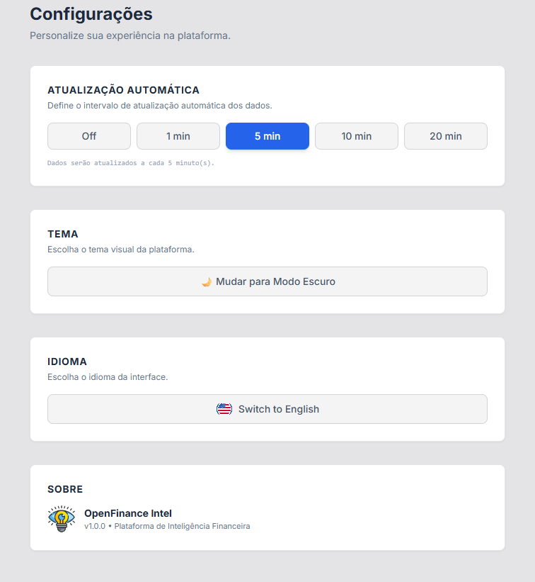
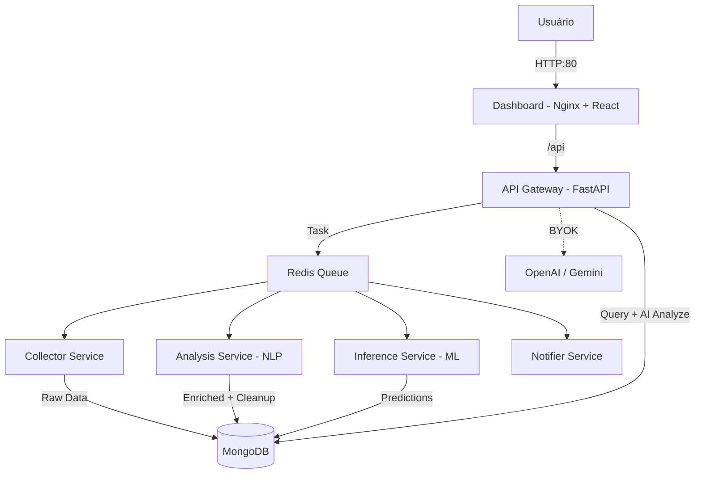

# OpenFinance Intel 🌍⚡

**Terminal de Inteligência de Investimentos** — IA, NLP, Machine Learning e LLMs para transformar o caos do mercado em **Sinais Acionáveis**.

O OpenFinance Intel monitora o ecossistema financeiro global em tempo real, coletando notícias, feeds de redes sociais e dados macroeconômicos. Usando **NLP**, **Machine Learning (predict_proba)** e **IA Generativa (OpenAI/Gemini)**, classifica cada evento como Bullish, Bearish ou Neutral, calcula probabilidade de impacto, e gera análises inteligentes — tudo organizado em 6 setores de investimento.

---

## 🚀 Funcionalidades Visuais

### 1. Market Overview (Visão Geral)

O painel de controle do investidor. Aqui você tem o pulso do mercado em uma única tela.

- **🧠 Bento Grid**: Layout moderno e responsivo.
- **📊 Fear & Greed Index**: Medidor de sentimento em tempo real (0-100).
- **🎯 Radar de Oportunidades**: Detecta anomalias e tendências com base em ML (`predict_proba`) + NLP.
- **⚡ Ticker**: Cotações de USD, EUR e BTC ao vivo.


---

### 2. Intelligence Feed (Feed de Inteligência)

Onde a notícia vira dado. O feed processa milhares de manchetes e entrega apenas o que importa.

- **🤖 Análise de IA**: Cada notícia recebe uma tag de sentimento (Bullish/Bearish) e um **Insight Acionável**.
- **🏷️ Filtros Macro**: Subcategorias granulares (Política Monetária, Geopolítica, Fiscal, Dados Econômicos).
- **📱 Social Sentiment**: Monitoramento de Reddit (WSB, Investing) e Twitter para captar o "humor da multidão".


---

### 3. Watchlist (Carteira de Monitoramento)

Nunca perca uma narrativa. Salve eventos e acompanhe o desdobramento da história.

- **⭐ Favoritos**: Clique na estrela em qualquer evento para salvar.
- **💾 Persistência**: Seus dados ficam salvos no navegador (Local Storage).
- **📉 Gestão de Risco**: Monitore ameaças potenciais de perto.


---

### 4. Probabilidade de Impacto (ML)

Análise quantitativa de risco. Cada evento recebe uma **probabilidade de impacto** via Machine Learning.

- **🤖 RandomForest**: Modelo treinado com `predict_proba` para classificação de risco.
- **📊 Cards filtráveis**: Alto Risco (🔴 ≥75%), Médio (🟡 50-74%), Baixo (🟢 <50%).
- **📄 Paginação estável**: 250 eventos mais recentes, 10 por página, sem embaralhamento.
- **📈 Estatísticas em tempo real**: Total, Alto, Médio, Baixo — referentes aos eventos exibidos.

---

### 5. AI Insights (IA Generativa)

Análise profunda sob demanda com **OpenAI GPT-4o** ou **Google Gemini 2.0**.

- **📋 Resumo de Alto Impacto**: Top 10 eventos ML → relatório executivo com ações recomendadas.
- **🔴 Detector de Crashes & Bolhas**: Métricas agregadas → índice de risco 0-100 com cenários.
- **📊 Análise de Mercado**: Dados por setor → conjuntura, perspectivas e alocação sugerida.
- **🔑 BYOK (Bring Your Own Key)**: User fornece a API key na interface. Nunca armazenada no servidor.

---

### 6. Configurações & Personalização

O terminal é seu. Ajuste para o seu fluxo de trabalho.

- **🎨 Temas**: Dark Mode (padrão) e Light Mode.
- **🌎 Idioma**: Tradução instantânea PT-BR / EN-US.
- **⏱️ Auto-Refresh**: Configure intervalos de 1 a 20 minutos para atualizações automáticas.



---

## 🏗️ Arquitetura Técnica

Todo o sistema roda em **Docker**, orquestrado via Docker Compose.



| Serviço       | Tecnologia              | Responsabilidade                               |
| ------------- | ----------------------- | ---------------------------------------------- |
| **Collector** | Python                  | Scraping RSS/Atom/Reddit, deduplicação via MD5 |
| **Analysis**  | Python, spaCy, TextBlob | NLP, Sentimento, Classificação + Auto-Cleanup  |
| **Inference** | Python, scikit-learn    | ML predict_proba, probabilidade de impacto     |
| **API**       | Python, FastAPI         | REST, Scheduler, AI Insights (OpenAI/Gemini)   |
| **Dashboard** | React 18, Vite, Nginx   | UI SPA, 6 abas, Nginx Reverse Proxy (Porta 80) |
| **Dados**     | MongoDB, Redis          | Persistência (NoSQL) e Mensageria (Pub/Sub)    |

---

## ⚡ Início Rápido

### Pré-requisitos

- Docker & Docker Compose

### Como Rodar

```bash
# 1. Clone o repositório
git clone https://github.com/Haell39/OpenFinance_Intel.git

# 2. Suba o ambiente (Build automático)
docker compose up --build
```

Acesse: **http://localhost** (porta 80)

> O sistema leva ~2 min para iniciar a coleta e preencher o banco de dados na primeira vez.

---

## 🛠️ Tech Stack

- **Backend**: Python 3.11, FastAPI, Pydantic
- **AI/NLP**: spaCy, TextBlob
- **Machine Learning**: scikit-learn (RandomForest, predict_proba)
- **IA Generativa**: OpenAI GPT-4o Mini, Google Gemini 2.0 Flash (BYOK)
- **Frontend**: React 18, Tailwind CSS, Lucide Icons, Recharts
- **Infra**: Docker, Nginx, MongoDB, Redis

---

_OpenFinance Intel — Transformando Notícia em Alpha._ 🚀
